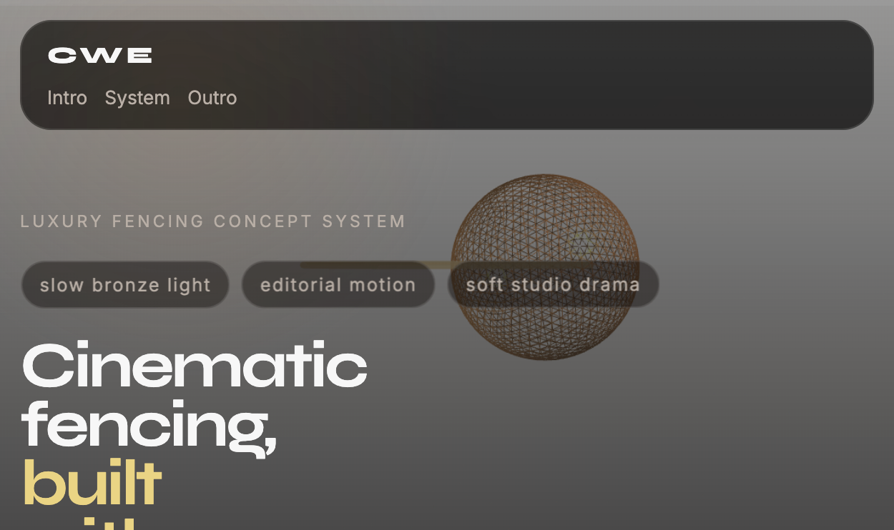

# Cinematic Web Experiences

Reusable cross-tool skill package for planning and prompting cinematic websites with:

- GSAP `ScrollTrigger`
- Three.js scenes
- custom shaders
- cinematic loading screens
- responsive scroll-based motion systems

The workflow is based on several real-world cinematic website builds.

This workflow works on its own, but the recommended companion for source asset generation is [`fal-ai-community/skills`](https://github.com/fal-ai-community/skills) when you need premium images, textures, loops, or supporting media.

## What this repo is

This repo packages the same workflow for three agent environments:

- `Cursor`
- `Codex`
- `Claude Code`

The skill teaches a repeatable process for:

- locking visual identity before motion
- choosing the right animation stack
- architecting sections before animation specs
- writing exact GSAP and Three.js instructions
- declaring files and external assets explicitly
- locking responsive behavior at the end

The shared source of truth is `shared/cinematic-web-experiences/guide.md`.

## Recommended companion stack

The core skill does not require any external API, but the recommended companion for image-led or video-led work is the `fal-ai-community/skills` repo, which provides reusable skills for generating and editing images, videos, audio, and 3D assets across agent workflows:

- Repo: [fal-ai-community/skills](https://github.com/fal-ai-community/skills)

Why promote `fal` with this workflow:

- it is the fastest way to create hero images, motion plates, textures, and supporting visuals before prompt integration
- it gives the cinematic site workflow stronger source material to animate, layer, and sequence
- it works especially well for luxury, editorial, fashion, hospitality, architecture, and product storytelling builds

Recommended use:

1. Use the fal skills to generate concept art, background loops, textures, or other visual assets.
2. Save the resulting media into your project.
3. Use `cinematic-web-experiences` to integrate those assets into the final site prompt with explicit paths, animation specs, and responsive behavior.

If a project already has assets or is fully procedural, you can skip `fal`. But if the goal is to showcase the strongest end-to-end workflow in this repo, `fal` is the preferred companion.

For typography-heavy frontends, this workflow can also pair well with `pretext`, a JavaScript/TypeScript library for multiline text measurement and layout that avoids DOM measurement/reflow and helps with accurate text wrapping, balanced line decisions, and rendering across DOM, canvas, or SVG:

- Repo: [chenglou/pretext](https://github.com/chenglou/pretext)

Recommended use:

1. Use `pretext` when the design relies on tight editorial text lockups, dynamic multiline headings, balanced callouts, or text-heavy cards where line breaks matter visually.
2. Measure and lay out text ahead of time instead of relying on repeated DOM measurements.
3. Keep `cinematic-web-experiences` focused on the visual system, motion, and section architecture while `pretext` handles text measurement accuracy.

## Included demo

This repo also includes a small working demo website for a hypothetical luxury brand, `Aurel Gates`, built from the same workflow and intentionally using the recommended `fal` companion path:

- `index.html`
- `styles.css`
- `main.js`

The demo includes fal-generated supporting assets:

- `assets/fal-hero-image.png`
- `assets/fal-bronze-texture.png`
- `assets/fal-background-loop.mp4`

The demo is intentionally lightweight, but it demonstrates the recommended pairing in this repo: use `fal` to create premium source assets, then use `cinematic-web-experiences` to integrate them into the final site architecture and motion system.

It also exercises the core patterns the skill recommends:

- cinematic loading screen
- looping background motion plate
- fixed fullscreen Three.js canvas
- shared `scrollProgress` animation bridge
- pinned hero section
- scroll-triggered reveal animations
- responsive type and layout behavior

To run it locally from the repo root:

```bash
python3 -m http.server 4173
```

Then open:

```text
http://127.0.0.1:4173
```

Screenshot:



## Skill name

Use the generic skill name:

```text
cinematic-web-experiences
```

## Repo layout

```text
.cursor/skills/cinematic-web-experiences/
.codex/skills/cinematic-web-experiences/
.claude/commands/cinematic-web-experiences.md
.claude/cinematic-web-experiences.md
shared/cinematic-web-experiences/guide.md
CLAUDE.md
AGENTS.md
```

## Quick start

1. Clone or copy this repo into a project you want to use with your agent.
2. Keep the hidden folders and root instruction files intact:
   - `.cursor/`
   - `.codex/`
   - `.claude/`
   - `CLAUDE.md`
   - `AGENTS.md`
3. Open the repo in your tool of choice.
4. Ask for help using the workflow, or explicitly reference the skill name:

```text
Use cinematic-web-experiences to help me design a premium GSAP + Three.js landing page.
```

## Setup

### Core skill setup

For the main skill itself, no build step is required. The repo-local files are already in the right places for:

- `Cursor`
- `Codex`
- `Claude Code`

If you are reusing the skill in another project, copy the platform-specific folders and root guidance files you need:

- `.cursor/skills/cinematic-web-experiences/`
- `.codex/skills/cinematic-web-experiences/`
- `.claude/`
- `CLAUDE.md`
- `AGENTS.md`

### Recommended fal setup

If you want to follow the recommended asset-generation path for this repo, use `fal` to generate images, textures, or video backgrounds before integrating them into the site workflow:

1. Copy `.env.example` to `.env`
2. Add your fal API key:

```env
FAL_KEY=your_real_key_here
```

3. Keep `.env` local only. It is gitignored by default.
4. Use the companion fal scripts or repo before integrating the final assets back into the website workflow.

This setup matches the fal community skills expectation that `FAL_KEY` is provided before running generation or model-search scripts [fal-ai-community/skills](https://github.com/fal-ai-community/skills).

This step is still optional, but it is the preferred path when promoting or demonstrating this workflow with premium generated media.

### Optional pretext setup

If your frontend is typography-led or you need deterministic multiline text layout:

```bash
npm install @chenglou/pretext
```

`pretext` is especially useful when you want to:

- pre-measure multiline headings without repeated DOM reads
- reduce layout shift for dynamic copy
- render balanced text in DOM, canvas, or SVG
- avoid `getBoundingClientRect` / `offsetHeight`-style layout reflow loops in text-heavy UI [chenglou/pretext](https://github.com/chenglou/pretext)

### Running the demo locally

From the repo root:

```bash
python3 -m http.server 4173
```

Then open:

```text
http://127.0.0.1:4173
```

## Platform guide

### Cursor

Cursor reads the repo-local skill from:

` .cursor/skills/cinematic-web-experiences/ `

What is included:

- `SKILL.md`: short trigger-focused skill entry
- `reference.md`: compact Cursor-friendly playbook

How to use it:

1. Open this repo, or copy `.cursor/skills/cinematic-web-experiences/` into another repo.
2. Ask Cursor for a cinematic website workflow, prompt, or architecture.
3. Mention the skill name explicitly if needed:

```text
Use cinematic-web-experiences to write a prompt for a shader-driven microsite with GSAP scroll choreography.
```

Good Cursor prompt examples:

```text
Use cinematic-web-experiences to plan a dark editorial landing page with pinned hero sections and scroll-triggered reveals.
```

```text
Use cinematic-web-experiences to turn this brand brief into a GSAP + Three.js build prompt with exact color values and section architecture.
```

### Codex

Codex reads the skill from:

` .codex/skills/cinematic-web-experiences/ `

What is included:

- `SKILL.md`: skill trigger and workflow summary
- `references/guide.md`: Codex-local reference
- `agents/openai.yaml`: UI metadata for the skill
- `AGENTS.md`: repo-level guidance

How to use it:

1. Open this repo in Codex, or copy `.codex/skills/cinematic-web-experiences/` into a repo where you want it available.
2. Keep `AGENTS.md` in the repo root so Codex has a clear top-level hint.
3. Invoke the skill by name in your prompt:

```text
Use $cinematic-web-experiences to create a multi-section website concept with a fixed Three.js canvas and exact ScrollTrigger settings.
```

Good Codex prompt examples:

```text
Use $cinematic-web-experiences to choose between a GSAP-only build and a GLB-based Three.js build for this luxury interior brand.
```

```text
Use $cinematic-web-experiences to produce a final builder-ready prompt for a cinematic hero with shader-based background distortion.
```

### Claude Code

Claude Code uses:

- `CLAUDE.md`
- `.claude/cinematic-web-experiences.md`
- `.claude/commands/cinematic-web-experiences.md`

How to use it:

1. Open this repo in Claude Code, or copy the `.claude/` folder and `CLAUDE.md` into another repo.
2. Ask naturally for help with a cinematic site, or use the slash command:

```text
/cinematic-web-experiences
```

3. Pass a concept, brand brief, or rough goal after the command if useful.

Good Claude Code prompt examples:

```text
/cinematic-web-experiences Create a prompt for a near-black fashion site with lime accents, pinned hero motion, and procedural shader background.
```

```text
Use the cinematic web workflow to convert this rough idea into a structured prompt with exact sections, animations, and responsive rules.
```

## What each platform should read

If you are adapting this repo or debugging behavior, these are the key files:

- Canonical workflow: `shared/cinematic-web-experiences/guide.md`
- Cursor wrapper: `.cursor/skills/cinematic-web-experiences/SKILL.md`
- Codex wrapper: `.codex/skills/cinematic-web-experiences/SKILL.md`
- Claude wrapper: `.claude/cinematic-web-experiences.md`
- Claude slash command: `.claude/commands/cinematic-web-experiences.md`
- Repo-level Codex hint: `AGENTS.md`
- Repo-level Claude hint: `CLAUDE.md`

## What the workflow covers

The canonical guide includes:

- the six-phase framework
- stack selection rules
- the universal prompt template
- exact animation-spec wording patterns
- asset declaration patterns
- responsive lock-down rules
- reusable GSAP snippets

## Prompting guidelines

The skill works best when the prompt is concrete and ordered. A good request usually includes:

1. `Brand or concept`
   - what the site is for
   - who it is for
   - the tone or mood
2. `Visual identity`
   - exact background, primary, accent, card, and text values
   - preferred typefaces and weights
3. `Animation stack`
   - `GSAP only`
   - `GSAP + Three.js + GLB`
   - `GSAP + Three.js + procedural shaders`
4. `Section architecture`
   - hero
   - content sections
   - outro/footer
   - optional loading screen
5. `Motion instructions`
   - exact transforms
   - exact `start`, `end`, `scrub`, and pinning behavior
6. `Asset plan`
   - existing file paths, or a request to generate assets first with fal
7. `Responsive rules`
   - `clamp()` typography
   - mobile nav behavior
   - camera adjustments
   - `overflow-x: hidden`

### Prompting rules of thumb

- Use exact hex or `hsl(...)` values instead of vague color names.
- Ask for one clear aesthetic direction instead of mixing many competing moods.
- Tell the model whether the page should be image-led, 3D-led, or typography-led.
- If assets do not exist yet, generate them first, then reference them by explicit path.
- If the design depends on exact multiline text lockups, call out `pretext` as an optional text-measurement helper.
- Treat each section as its own animation stage with clear ownership.
- End with a dedicated responsive block.

### Example prompt shape

```text
Use cinematic-web-experiences to create a premium single-page site for a luxury architectural fencing brand.

Visual direction:
- Background: #050505
- Card: #15120f
- Primary: hsl(28 42% 58%)
- Accent: hsl(46 78% 70%)
- Fonts: Syne 700/800 + Inter 300/400/500

Stack:
- GSAP + Three.js
- fixed fullscreen canvas
- looping background video

Sections:
- pinned hero
- three feature sections
- editorial outro with CTA

Animations:
- hero pins and scales down on scroll
- content cards reveal from x offsets with scrub
- 3D atmosphere reacts to a shared scrollProgress value

Assets:
- use existing images from /assets
- if needed, generate one additional bronze texture and one background loop first
- use pretext if headline wrapping and balanced multiline layout need to be deterministic

Responsive:
- clamp() typography
- stacked mobile layout
- overflow-x hidden on html, body, #root
```

### Example prompts by goal

Use these as copy-paste starters when you want to design something specific with the skills in this repo.

`Brand-first cinematic landing page`

```text
Use cinematic-web-experiences to design a premium landing page for a contemporary furniture studio called Obsidian Form.

Visual direction:
- Background: #060606
- Surface: #141414
- Primary: hsl(22 20% 72%)
- Accent: hsl(48 92% 70%)
- Foreground: #f5f1eb
- Fonts: Syne 700/800 + Inter 300/400/500

Stack:
- GSAP + ScrollTrigger
- fixed fullscreen background layer
- no 3D model unless clearly justified

Sections:
- loading screen
- pinned hero
- three collection sections
- editorial outro with CTA

Motion:
- hero pins for 180vh and scales from 1 to 0.82
- section cards reveal from alternating x offsets with scrub
- ambient background elements drift slowly with mouse tracking

Responsive:
- clamp() typography
- stacked mobile layout below 900px
- overflow-x hidden on html, body, #root
```

`Generate assets with fal, then integrate them`

```text
First use fal-ai-community/skills to generate these assets for a luxury travel brand called Serein Isles:
- one hero image with limestone architecture at dusk
- one looping ocean-haze background video
- two supporting material/detail images

Save the outputs into /assets.

Then use cinematic-web-experiences to build a premium single-page website that integrates those exact asset paths.

Requirements:
- GSAP + Three.js with a fixed fullscreen canvas
- soft parallax over the generated hero image
- background video behind the WebGL atmosphere
- explicit section architecture and exact ScrollTrigger settings
- responsive rules for mobile camera distance and stacked layout
```

`Typography-led experience with pretext`

```text
Use cinematic-web-experiences and pretext to design a typography-led microsite for a fashion imprint called Afterlight Bureau.

Goal:
- the site should feel editorial, restrained, and text-driven
- multiline headings must stay visually balanced across breakpoints
- one section should include an interactive text composition with draggable objects

Stack:
- GSAP + ScrollTrigger
- pretext for measured multiline headlines, balanced pull quotes, and interactive text layout
- minimal Three.js only if it improves the atmosphere without distracting from the typography

Output:
- exact section plan
- exact animation specs
- where pretext should be used and why
- responsive rules for deterministic text lockups on tablet and mobile
```

`Full-stack cinematic concept`

```text
Use cinematic-web-experiences to create a builder-ready prompt for a luxury skincare brand called Vanta Veil.

Visual identity:
- Background: #040404
- Card: #12100f
- Primary: hsl(18 32% 60%)
- Accent: hsl(160 58% 68%)
- Foreground: #f4efe8
- Fonts: Syne 700 + Inter 300/400/500

Stack:
- GSAP + Three.js + procedural shader atmosphere
- optional fal-generated texture and background loop
- pretext for the hero lockup and one balanced editorial callout

Sections:
- cinematic loading screen
- pinned 100vh hero
- ingredient story section
- product ritual section
- testimonial/editorial quote section
- final CTA

Animations:
- exact hero pinning, start/end, scrub, scale, and y transforms
- shader scene reacts to shared scrollProgress
- cards reveal with staggered viewport-entry motion
- mouse-tracked accent elements in the hero

Responsive:
- clamp() typography
- mobile nav overlay
- simplified shader intensity on small screens
- camera.position.z adjustment for mobile
```

## Best practices

- If Three.js is used, pin `three@0.136.0` and `@types/three@0.136.0`.
- For 3D scenes, prefer a fixed fullscreen canvas with `pointer-events: none`.
- Keep prompts exact: colors, transforms, trigger points, asset paths, and responsive rules should all be explicit.
- Treat each section as its own animation stage with its own trigger ownership.
- Default to one strong accent color on a restrained background unless the project clearly needs a different palette.

## Example requests

These work well across tools:

```text
Use cinematic-web-experiences to build a prompt for a premium one-page studio website with GSAP reveals and a pinned hero.
```

```text
Use cinematic-web-experiences to decide whether this concept should be GSAP-only, GLB-based Three.js, or fully procedural shaders.
```

```text
Use cinematic-web-experiences to transform this moodboard and brand brief into exact color tokens, section architecture, and animation specs.
```

```text
Use fal-ai-community/skills to generate a hero image, texture, and looping background video for a luxury brand, then use cinematic-web-experiences to integrate them into a GSAP + Three.js landing page.
```

```text
Use cinematic-web-experiences with pretext to design a typography-led landing page with balanced multiline headlines, draggable editorial text composition, and clear responsive text rules.
```

## Sharing this repo

If you publish this to GitHub:

- keep the hidden directories committed
- keep `CLAUDE.md` and `AGENTS.md` in the repo root
- keep `.env` out of version control and commit only `.env.example`
- mention the skill name `cinematic-web-experiences` in the repo description or release notes
- tell users they can either use this repo directly or copy the relevant platform folder into an existing project
